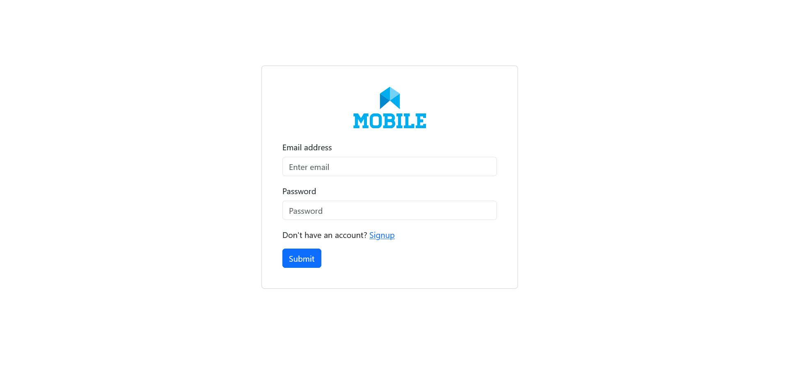
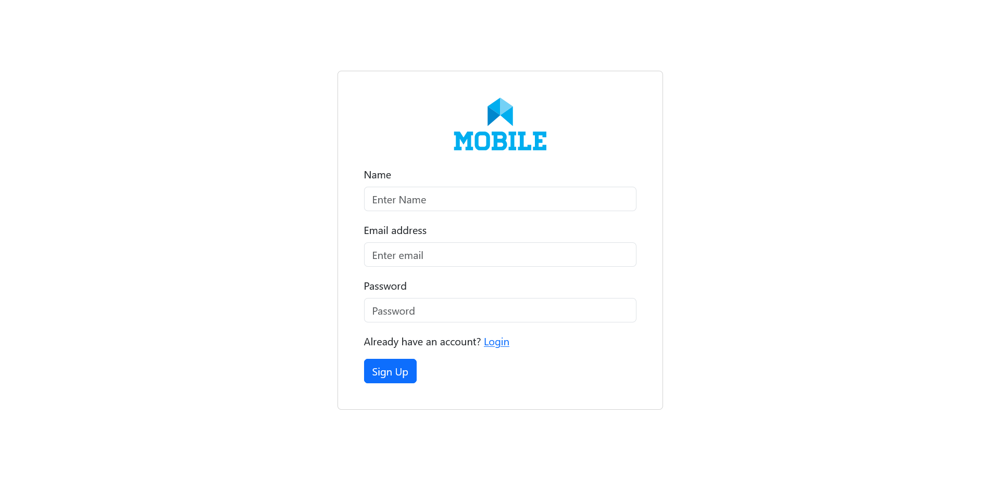
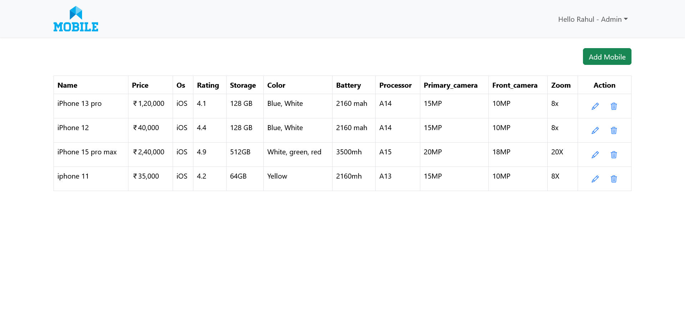
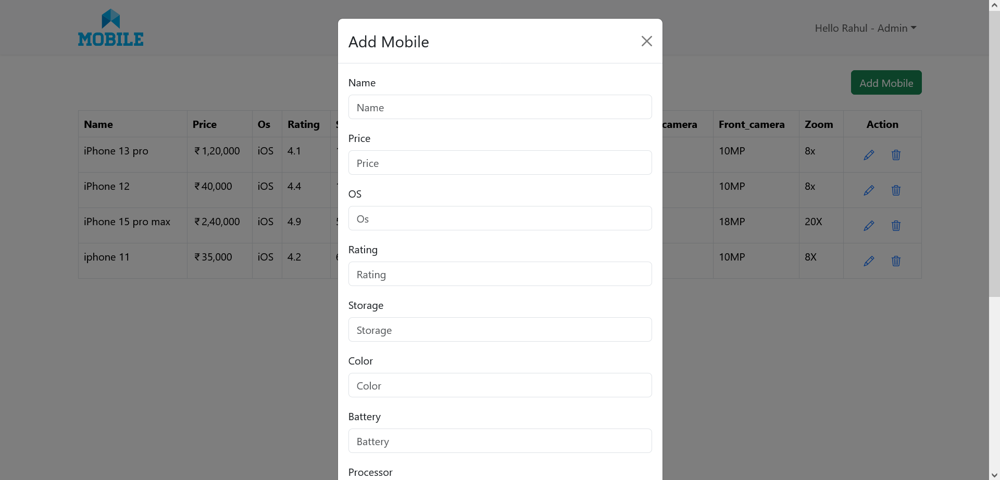
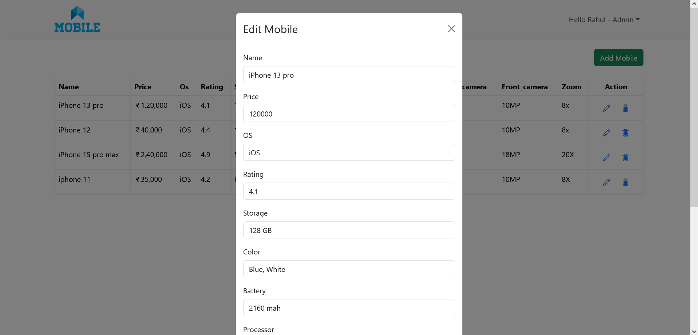

# React Mobile Comparison App

## Table of Contents
- [Introduction](#intro)
- [Login](#login)
- [Signup](#signup)
- [Mobile List - Admin](#mobile)
- [Mobile Add](#add)
- [Mobile Edit](#edit)
- [Mobile List - Client](#mobile-user)
- [Mobile selection](#selection)
- [Mobile Compare](#compare)
- [User Logout](#logout)

## Introduction
The **React Mobile Comparison App** is a web application that allows users to compare different mobile phones based on their specifications. The app provides a user-friendly interface for browsing, comparing, and viewing details of various mobile devices. There are 2 interfaces: 1. Admin and 2. Client

## Login

This is a Login Page. The Admin and Client can log in from the same login page and see the pages and content based on their permissions.

## Signup

This is a Signup Page. The User will sign up after filling out the form. The roles will be managed from the database as of now.

## Mobile List - Admin

This is a Mobile Listing page for Admin. Admin can manage the mobile listing by adding, editing, or deleting the mobile.

## Mobile Add

This is an Add Mobile form that will show once the Admin clicks the Add Mobile button. Admin will fill in all the mobile information and save the form so the mobile will be added to the mobile listing page.

## Mobile Edit

This is an Edit Mobile form that will show once the Admin clicks the Edit Icon. Admin will edit the mobile information and save the form so the mobile will be edited on the mobile listing page.

## Mobile Delete

Admin can delete the mobile by clicking on the Delete icon on the mobile list page

## Mobile List - Client

This is a Mobile Listing page for CLient.

